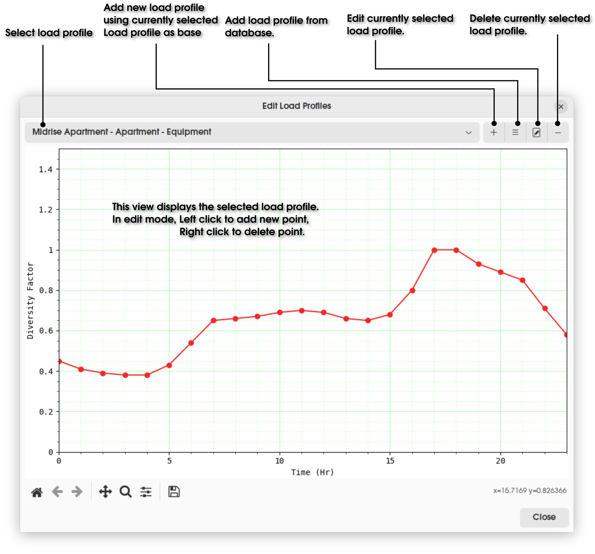
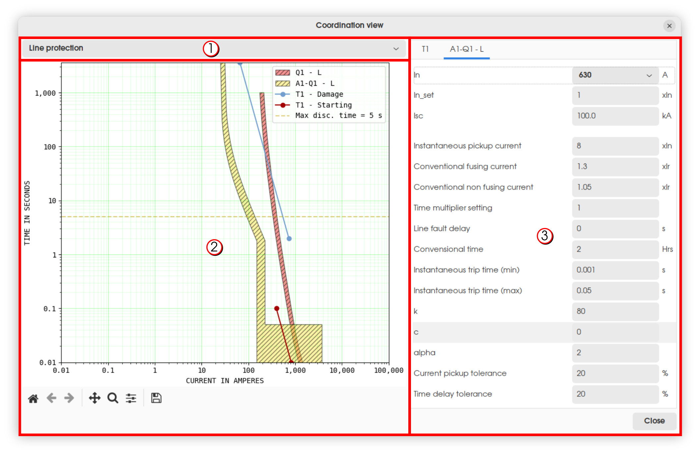
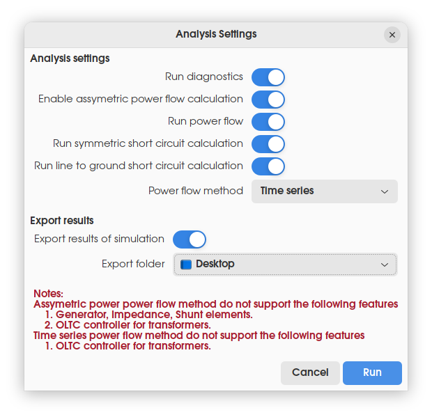

# Features Overview

This section displays the various features available in GElectrical for the analysis/ documentation of electrical networks.

## Add/ edit daily load profiles
(load_profile)=



Daily load profiles are used in `Time series` power analysis to model variation of load/ power generation over the day. Load profiles are supported by all load elements and static generation elements.

## Protection coordination
(protection_coordination)=



Protection coordination provides a convinient interface to view and edit parameters for acheiving protection coordination between elements. For using this module, select breakers/ fuses, lines, transformers, motors or node elements which are involved in the co-ordination problem and click on the toolbar button for this option in [project toolbar](project_toolbar) to view the protection coordination dialog window as given above.

The interface is divided into three section which are indicated by the numbered markers in the above figure. These are described below.

1. This combobox allows switching between `Line Protection` and `Ground Protection` coordination curves for breaker elements.
2. This view displays the time-current co-ordination curves for the selected elements. The various curves displayed are enumerated below.
    1. Breaker/ fuse time-current operation curves. Below the hatched portion, the device will not operate. Above the hatched portion, the device will operate. Inside the hatched portion, the device may or may not operate.
    2. Cable damage curve. The operating point should be below the damage curve to prevent damage to the cable.
    3. Motor/ transformer starting and damage curves. During motor/ tranformer starting, to prevent nuisance tripping, the protection curve should be above the starting curve. To prevent damage to the device, the operating point should be below the damage curve.
    4. Maximum disconnection time for automatic disconnection of supply.
    5. Maximum and minimum fault current values for the selected node elements.
3. This pane allows the modification of protection related parameters of the selected elements so as to acheive co-ordination between elements.

## Run analysis
(run_analysis)=



This module allows various analysis functions to be run for simulating the behaviour of the electrical network at various conditions. Results of the analysis will be displayed in the results tab of the right pane for each element. Results may also be exported to a PDF report. The various options available are listed below.

```{list-table}
:header-rows: 1

* - Slno.
  - Option
  - Description
* - 1
  - Run diagnostics
  - Runs diagnostics on the electrical scheme to identify common issues that may affect simulations.
* - 2
  - Enable assymetric power flow calculation
  - Allows assymetric elements to be used in power flow. Note that all elements may not be supported while using this mode.
* - 3
  - Run power flow
  - Runs power flow for the network. The type of power flow to be run will be decided by the option given by the user.
* - 4
  - Run symmetric short circuit calculation
  - Run symmetric short circuit calculation as per IEC-60909.
* - 5
  - Run line to ground short circuit calculation
  - Run line to ground short circuit calculation as per IEC-60909.
* - 6
  - Power flow method
  - This option selects the type of powerflow analysis to run. These are described below.
* - 7
  - Export results of simulation
  - Export the simulation results to the selected folder. The exported files include pdf drawing, pdf report detailing the electrical network \& simulation results, pandapower html report, connectivity html graph and pandapower json network definition file.
* - 8
  - Export folder
  - Folder to which the results of the simulation are to be exported.
```

Types of power flow analysis options available are described below.

1. **Power flow**:\
This is a regular power flow analysis. The diversity factors (`DF`) specified for the `Bus Bar` elements are negleted. The `Load Profiles` specified for load and static generation elements are also negleted.
2. **Power flow with diversity**:\
This is a regular power flow analysis but considering diversity factors specified for the `Bus Bar` elements. The upstream power flow at each `Bus Bar` element with diversity factor (`DF`) is reduced by the selected factor. This is internally achived by adding phantom static generation elements at `Bus Bar` elements to inject the difference in power flow to be reduced. The `Load Profiles` specified for load and static generation elements are negleted.
3. **Time series**:\
This is a time series power flow analysis with power flow solutions obtained for each hour of the day. Each of the individual power flow analysis is performed similar to the first option but by adjusting the various loads and static generation elements according to the `Load Profiles` selected for these elements.

## Run electrical rules check
(elec_rules_check)=

This module checks the scheme for violations of common wiring rules like loading limits, protection coordination between elements, automatic disconnection of supply etc. The supported rules are described in detail below. 

Powerflow and shortcircuit (symmetric and line to ground) analysis functions should be run before running this module. Results of the rules check will be displayed in the messages tab of the right pane.

### Rules for Lines 

```{list-table}
:header-rows: 1

* - Slno.
  - Rule
  - Description
* - 1
  - Line loading % < 100%
  - Checks whether lines are loaded within the permissible limit.
* - 2
  - Line loss % < X %
  - Checks whether the maximum line loss (as a percentage of power transmitted) is within the limit specified in `Project Settings` -> `Rules Check`.
* - 3
  - Line protection by upstream breaker
  - Checks whether all lines are protected satifactorily by upstream breaker/ fuse elements. A line is considered as protected if the damage curve of the line is lying above the breaker operating curve upto the available value of fault current.
* - 4
  - Automatic disconnection time of line < X s
  - Checks whether the automatic disconnection of lines are acheived by upstream breakers within the time limit specified in `Project Settings` -> `Rules Check`.
* - 5
  - CPE conductor sized for fault current
  - Checks whether the CPE (Circuit Protective Earthing) conductors of lines are adequetly sized to carry fault currents available at the line downstream nodes.
```

### Rules for Transformers

```{list-table}
:header-rows: 1

* - Slno.
  - Rule
  - Description
* - 1
  - Transformer loading % < 100%
  - Checks whether tranformers are loaded within the permissible limit.
* - 2
  - Transformer protection by upstream breaker
  - Checks whether transformers are protected satifactorily by upstream breaker/ fuse elements. A transformer is considered as protected if the damage curve of the transformer is lying above the breaker operating curve upto the available value of fault current.
* - 3
  - Transformer inrush current coordination with upstream breaker
  - Checks whether the upstream breaker/ fuse element of tranformers do not operate during transformer startup. This is considered satisfied if the starting curve of the transformer is lying below the breaker operating curve.
```

### Rules for Motors

```{list-table}
:header-rows: 1

* - Slno.
  - Rule
  - Description
* - 1
  - Motor protection by upstream breaker
  - Checks whether motors are protected satifactorily by upstream breaker/ fuse elements. A motor is considered as protected if the damage curve of the motor is lying above the breaker operating curve upto the available value of fault current.
* - 2
  - Motor inrush current coordination with upstream breaker
  - Checks whether the upstream breaker/ fuse element of motors do not operate during motor startup. This is considered satisfied if the starting curve of the motor is lying below the breaker operating curve.
```

### Rules for Breakers

```{list-table}
:header-rows: 1

* - Slno.
  - Rule
  - Description
* - 1
  - Breaker short circuit current < Fault level
  - Checks whether the short circuit current rating specified for breakers are less than the available fault current at the breaker downstream node.
* - 2
  - Breaker coordination with upstream
  - Checks whether breakers/ fuses co-ordinates fully with the upstream breakers/ fuses. This is considered satisfied if the breaker operating curve of the downstream device is fully lying below the breaker operating curve of the upstream device.
```

### Rules for Loads

```{list-table}
:header-rows: 1

* - Slno.
  - Rule
  - Description
* - 1
  - Automatic disconnection time of load < X s
  - Checks whether the automatic disconnection of loads are acheived by upstream breakers within the time limit specified in `Project Settings` -> `Rules Check`.
* - 2
  - Voltage drop  < X %
  - Checks whether the maximum voltage drop at the load is within the limit specified in `Project Settings` -> `Rules Check`.
```

### Rules for checking connectivity issues

```{list-table}
:header-rows: 1

* - Slno.
  - Rule
  - Description
* - 1
  - Three phase load connected to three phase line
  - Checks whether three phase load elements are connected to three phase lines.
```
