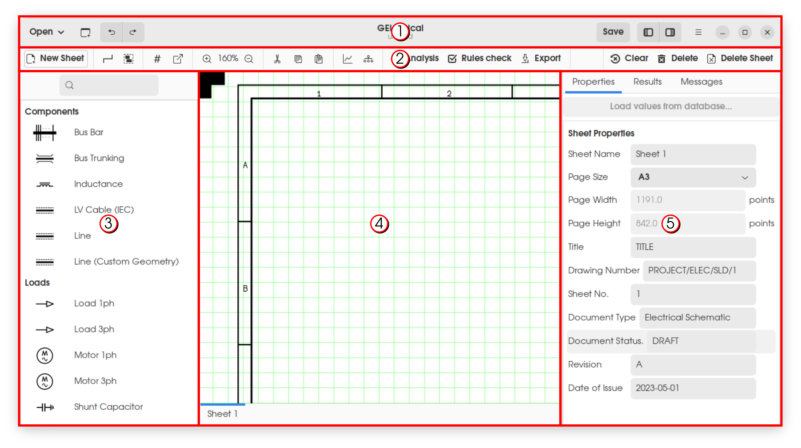

# Getting Started

## User Interface Overview



GElectrical interface is divided into five components which are indicated by the numbered markers in the above figure. They are described below.

1. [Application toolbar](application_toolbar):\
    Toolbar containing buttons for accessing commonly used application level functions.
2. [Project toolbar](project_toolbar):\
    Tool bar containing buttons for accessing commonly used project related functions.
3. [Components side-bar](components_side_bar):\
    Sidebar allows insertion of elements into drawing view.
4. [Drawing View](drawing_view):\
    Drawing view allows defining the electrical single line diagram for the project by addition and modification of schematic elements and defining connectivity between elements.
5. [Properties side-bar](properties_side_bar):\
    Sidebar allows the following functions.
    1. Modification of properties of the selected elements.
    2. Viewing simulation results for the selected elements.
    3. Viewing messages output by analysis functions.


## Application Toolbar
(application_toolbar)=


The items in the application toolbar provides access to application management related functionalities of GElectrical. User interface elements indicated by numbered markers in the above figure are described below.

1. Shows a popup widget to open an existing project. Recently opened files are shown in the popup widget. Double clicking on the project name opens the selected project. If the required project file is not availabe in the selection list, a file browser can be openened by clicking on the `Other Projects...` button.
2. Create a new project.
3. Undo (`Ctrl`+`z`)/ Redo (`Ctrl`+`Shift`+`z`) actions performed by the user.
4. Displays application name and project filename.
5. Save project file (`Ctrl`+`s`).
6. Show/ hide left/ right side-bars.
7. Show [Application Menu](application_menu).

### Application Menu
(application_menu)=

The application menu provides access to less frequently used functionality of GElectrical. The items in the menu are described below.

```{list-table}
:header-rows: 1
:widths: 10 30 60

* - Slno.
  - Menu Item
  - Description
* - 1
  - Save As
  - Save the current project to new a project file.
* - 2
  - Print
  - Allows prinitng of schematic drawings. The pages to be printed and printing options may be selected by the user.
* - 3
  - Project Preferences
  - Show project preferences dialog. These settings will be applicable only for the current project.
* - 4
  - Program Settings
  - Show program settings dialog. These settings are application wide and will be applicable to all projects.
* - 5
  - Help
  - Opens a browser window showing the application documentation.
* - 6
  - Keyboard Shortcuts
  - Shows a dialog listing out the keyboard shortcuts supported by the application.
* - 7
  - About GElectrical
  - Show information relating to GElectrical.
* - 8
  - Quit
  - Quit application
```

## Project toolbar
(project_toolbar)=


The items in the project toolbar provides access to most of the project related functionality of GElectrical. Their contents are listed and described below. Contextual help is also available for these functions in the form of tooltips which can be viewed by placing the mouse cursor over the buttons.

1. Add a new drawing sheet.
2. Draw a wire interconnecting element ports.
    1. `Left Mouse Button` adds a new point.
    2. Clicking on an element port or double clicking `Left Mouse Button` finishes drawing of wire.
    3. `Right Mouse Button` cancels the drawing of wire.
3. Group selected elements into an assembly (`Ctrl`+`g`).\
Assemblies may be used for panels, enclosures or any other logical grouping of elements. This option may be used for adding or modifying assembly of elements as described below.
    1. Add new assembly:\
       Select the elements to be grouped and click on the toolbutton.
    2. Edit existing assembly:\
       Select the new elements to be grouped, existing assembly elements, existing assembly and click on the toolbutton
4. Assign reference numbers to elements.\
Reference numbers helps to identify elements. Numbering can be carried out for selected elements only/ new elements only/ for all elements.
5. Link cross reference element.\
Cross reference elements allows connecting different parts of the scheme within/ across sheets. This option opens a dialog for linking the selected cross reference element with other cross reference element(s) within the project.
6. Zoom-in/ Zoom-out [Drawing View](drawing_view).
7. Cut/ Copy/ Paste elements in [Drawing View](drawing_view).
8. [Add/ edit daily load profiles.](load_profile)\
Daily load profiles can be assigned to load elements or static generation elements. This can be used in time series power simulation to model variation of load/ power generation over the day.
9. [Protection coordination.](protection_coordination)\
Allows viewing and editing element parameters for protection coordination. Select breakers/ fuses, lines, transformers, motors or node elements and select this option to view protection coordination dialog window.
10. [Run analysis.](run_analysis)\
Runs diagnostics on scheme to identify common issues, power flow (with diversity factors/ without diversity factors/ time series), short circuit (symmetric/ line to ground).\
Results of the analysis will be displayed in the results tab of the right pane for each element. Results may also be exported to a PDF report.
11. [Run electrical rules check.](elec_rules_check)\
Checks the scheme for violations of common wiring rules like loading limits, protection coordination between elements, automatic disconnection of supply etc.\
Powerflow and shortcircuit (symmetric and line to ground) analysis functions should be run before running this module.\
Results of the rules check will be displayed in the messages tab of the right pane.
12. Export drawing to PDF.
13. Clear analysis results and node elements that are inserted during analysis.
14. Delete selected elements.
15. Delete currently selected drawing sheet.

## Components side-bar
(components_side_bar)=

```{figure} assets/images/components_side_bar.png
:align: center
:width: 700px
```

Components side-bar allows insertion of elements into drawing view. On selecting an element in components side-bar, the insertion mode is activated and a floating model is enabled which follows the cursor on the drawing view. This floating model can be added to the drawing view by clicking the `Left Mouse Button`. Multiple models may be added by pressing down `Shift` while clicking the `Left Mouse Button`. To cancel insertion of element, use the `Right Mouse Button`. The components side-bar also incorporates a search bar for filtering the list of elements.

During insertion of the element, the components side-bar is replaced by the insertion view. This view allows manipulation of the element being inserted. Selecting `Rotate` (`R`), rotates the floating model from vertical to horizontal or vice versa. Selecting `Cycle Port` (`C`) selects the point of attachment (relative to the cursor) of the floating model.

Insertion may also display fields which can be modified to modify the behaviour of the floating modal for certain elements like `Bus Bar` or `Text Display Element`.

## Drawing View
(drawing_view)=

```{figure} assets/images/drawing_view.png
:align: center
:width: 700px
```

Drawing view allows defining the electrical single line diagram for the project by addition and modification of schematic elements and defining connectivity between elements. The elements are added into the drawing view using the [components side-bar](components_side_bar). The properties of the inserted elements can be viewed in the [properties side-bar](properties_side_bar) by selecting the element in the drawing view. Selected elements can be deleted by pressing the `Delete` button or by selecting the function available in the [project toolbar](project_toolbar).

The various elements inserted in the drawing view can be selected using the `Left Mouse Button`. Pressing down `Shift` while selecting elements allows multiple elements to be selected. 

Box selection mode can be entered by clicking `Left Mouse Button` on a blank area of the drawing view. A box selection is shown which follows the mouse cursor. The selection can be finished by clicking `Left Mouse Button`. The elements in the area bounded by the box selection will become selected.

While some elements are selected, clicking on a blank area of the drawing view or pressing `Escape` clears all selection.

All the sheets available in the project can be accessed using the tab bar at the bottom of the drawing view. Functions for addition and deletion of sheets can be accessed using the [project toolbar](project_toolbar).

## Properties Side-bar
(properties_side_bar)=


```{figure} assets/images/properties_sidebar.png
:align: left
:width: 300px
```

This sidebar allows has three tabs which are described below.

1. **Properties**: Modification of properties of the selected elements.
2. **Results**: Viewing simulation results for the selected elements.
3. **Messages**: Viewing messages output by analysis functions.

The **Properties** tab displays the properties of the currently selected element in the [Drawing View](drawing_view). If multiple elements of the same kind are selected, common fields assosiated with these elements will be visible. If no elements are selected, it shows properties of the selected sheet. Each property has a caption followed by a text field for entering/ viewing values assosiated with the property. After editing these fields, the values can be saved by pressing `Enter` (`Ctrl`+`Enter` for multiline fields).

Contextual help is available for the fields in the form of tooltips which can be viewed by placing the mouse cursor over the corresponding field.

The **Results** tab displays the results of various analysis run by the user. By default, this tab will be blank. It will become populated once various analysis options are run.

The **Messages** tab displays messages that are output by certain analysis functions like `Diagnosis` and `Electrical Rules Check`. If certain elements are referenced by these messages, these elements can be selected by double clicking (`Left Mouse Button`) those message fields.

