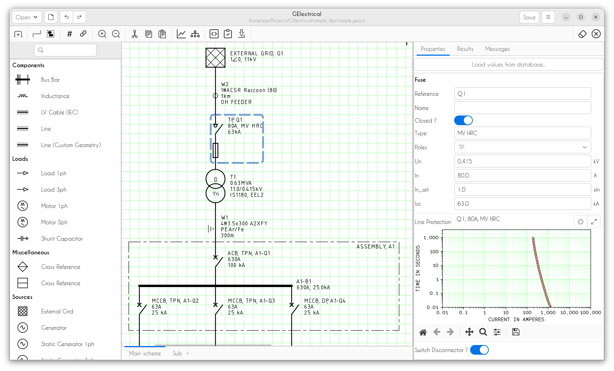
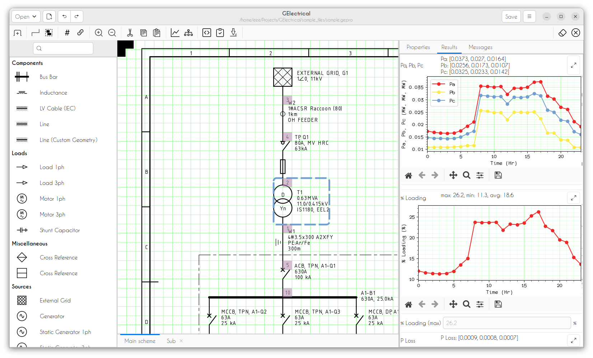
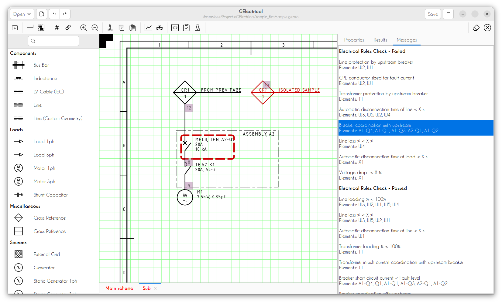
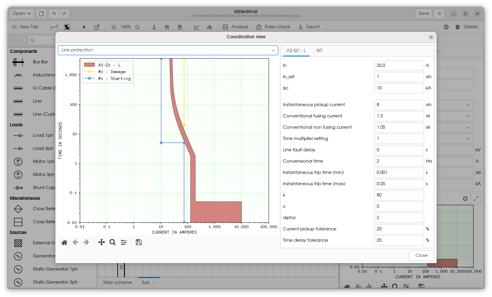
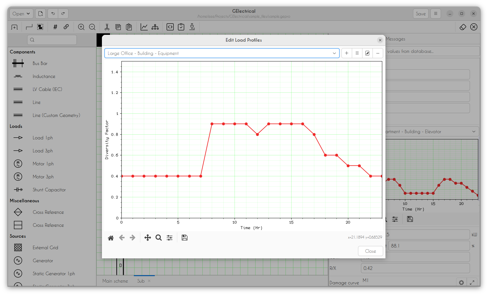
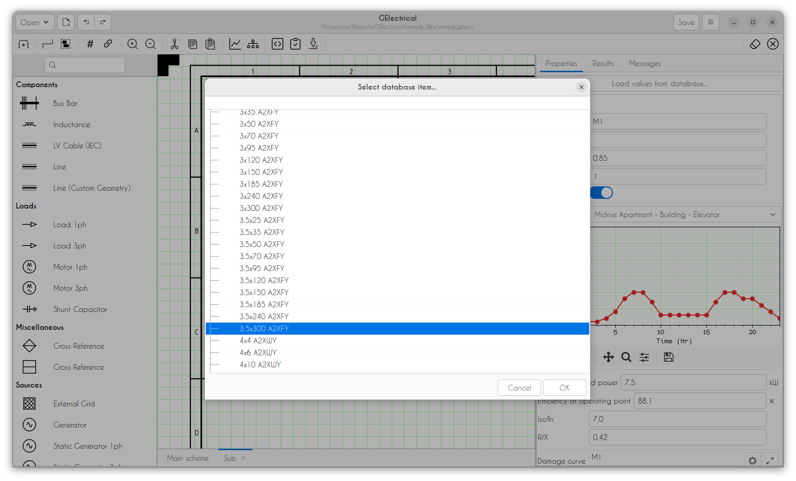

# Introduction

## General

GElectrical is a free and opensource electrical system analysis software for LV/MV electrical distribution networks. Following features are currently implemented.

* Schematic capture.
* Pandapower network generation from schematic.
* Power flow time series analysis (Symmetric and Assymetric).
* Power flow with diversity factors (Symmetric and Assymetric).
* Voltage drop analysis.
* Short circuit analysis (Symmetric and SLG).
* Coordination analysis for power supply protection devices with support for CB and fuse protection curves; damage curves for transformers, cables and motors.
* Support for daily load curves for load elements.
* Support for arriving network parameters for custom geometry OH lines.
* Support for modeling networks with mixed TN-S/ TN-C/ TT/ IT earthing systems.
* Electrical rules check for checking conformity with IEC/ local electrical guidelines.
* Print and export of drawings to pdf.
* Generation of analysis reports.

```{admonition} Read before using ...
Please note that the program is in active development and bugs are expected. Cross checking of generated calculations is reccomended. See [Roadmap](https://github.com/manuvarkey/GElectrical/issues/1) for current limitations.
```


## Screenshots

```{admonition} Screencasts
See [Screencasts](https://www.youtube.com/playlist?list=PLyFdF5OlDZHI8DBi42qsmUeiiD2Cd0eLU) for application screencasts
```








## Sample Files

* [Sample schematic](https://raw.githubusercontent.com/manuvarkey/GElectrical/master/sample_files/sample_drawing.pdf)
* [Sample report](https://raw.githubusercontent.com/manuvarkey/GElectrical/master/sample_files/sample_report.pdf)
* [Sample project file](https://github.com/manuvarkey/GElectrical/raw/master/sample_files/sample.gepro)

## Links

* [Website](https://manuvarkey.github.io/GElectrical/)
* [Documentation](https://gelectrical.readthedocs.io)
* [Forum](https://github.com/manuvarkey/GElectrical/discussions/)
* [Bug tracker](https://github.com/manuvarkey/GElectrical/issues)
* [Git repository](https://github.com/manuvarkey/GElectrical)

